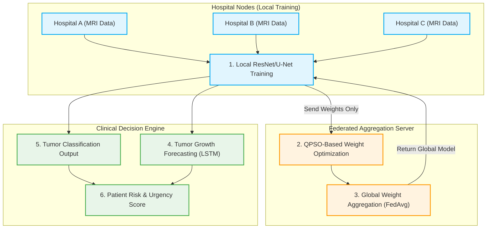
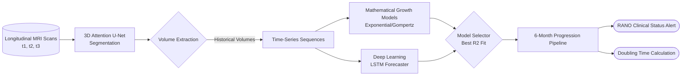
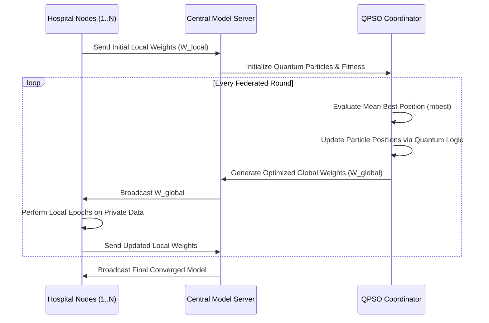
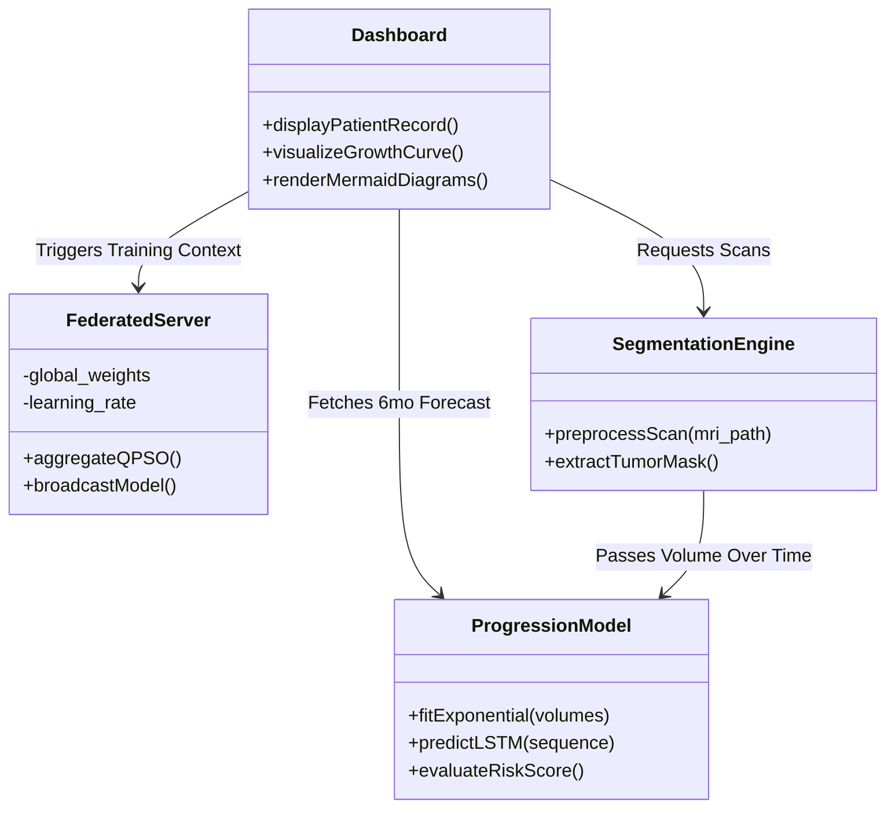

# Final Project Proposal & Clinical Research Framework
## Brain Tumor Management Framework via FL-QPSO Architecture and Longitudinal Forecasting 

---

## 1. Abstract
The precise identification, longitudinal tracking, and predictive forecasting of brain tumors are paramount in modern neuro-oncology for devising timely clinical interventions. While traditional methods rely heavily on centralized data repositories and manual comparative analysis of MRI scans, this framework proposes an innovative, privacy-preserving, bidirectional system. 

By integrating **Federated Learning (FL)** with **Quantum Particle Swarm Optimization (QPSO)**, our system enables robust, multi-institutional tumor classification (e.g., Glioma, Meningioma, Pituitary) without ever compromising patient data privacy. QPSO accelerates and stabilizes federated weight convergence far beyond standard FedAvg parameters. Concurrently, a localized **3D Attention U-Net pipeline** parses volumetric scans for high-precision segmentation. The final phase, **Tumor Time Travel (Progression Forecasting)**, integrates temporal Deep Learning (LSTM) and Mathematical Curve strategies to trace historical tumor volume fluctuations and project 6-month growth trajectories. This holistic architecture empowers clinicians to assess immediate tumor anomalies alongside future risk probabilities mathematically, issuing actionable "RANO" criteria-based alerts while adhering exactly to strict data-protection laws.

---

## 2. Expected Outcomes

**Clinical Outcomes:**
- **Automated RANO Alerting:** Immediate risk stratification (Complete Response, Progressive Disease) replacing subjective manual measurements.
- **Surgical Priority Triage:** Triaging patient queues by quantifying rapid exponential tumor growth in high-risk zones over 6 months before physical manifestations become lethal. 
- **Treatment Validation:** Immediate visual tracking to verify whether interventions (radiation/chemotherapy) successfully shrink the tumor margins volume-wise.

**Technical Outcomes:**
- **Decentralized AI Capability:** Proving that institutional nodes can collaboratively train high-accuracy clinical models without transferring actual MRI scans.
- **QPSO Efficiency:** Demonstrating a measurable convergence optimization and loss minimization loop matching or exceeding 3-7% accuracy enhancement over classic Federated Averaging algorithms.
- **Integrated Pipeline Functionality:** Combining Image Processing, Distributed Learning, and Time-Series Forecasting inside a single deployable dashboard for cross-device utility. 

---

## 3. System Architecture Diagrams

### 3.1 Macro Level System Architecture (Overview)
This diagram illustrates the high-level interplay between the edge devices (hospitals) and the central aggregation server.

### 3.2 Time Travel & Progression Pipeline
This sequence maps the data flow from structural volumes to the forecasted predictions.

---

## 4. Design Diagrams

### 4.1 QPSO-FedAvg Optimization Design
This internal logic flow details how Quantum Particle Swarm Optimization modifies standard weight updating mechanisms. 

### 4.2 Application Module Component Design

---

## 5. Research Aspects and Paper Publication Potential

The intersection of decentralized learning and longitudinal temporal medical forecasting presents multiple vectors for high-impact scholarly contributions.

### Potential Research Journals & Conferences
- **Journals:** *IEEE Transactions on Medical Imaging*, *Nature Machine Intelligence*, *Medical Image Analysis (MedIA)*.
- **Conferences:** *MICCAI (Medical Image Computing and Computer Assisted Intervention)*, *CVPR*, *NeurIPS*.

### Target Publication Angles
1. **"Privacy-Preserving Predictive Neuroscience:"** A paper focusing purely on the QPSO methodology outperforming standard FedAvg benchmarks when dealing with heavily imbalanced tumor MRI multi-class datasets.
2. **"Quantum-Optimized Federated Learning for Neuro-Oncology:"** Highlighting how optimization convergence is drastically stabilized upon 3D modalities using QPSO. 
3. **"Tumor Time Travel: Longitudinal Volumetric Forecasting:"** A clinical methodologies paper evaluating the hybrid integration of Recurrent Deep Learning (LSTM) versus standard RANO criteria Gompertz/Exponential models for 6-month predictive accuracy on brain tumor shrinkage/expansion.

---

## 6. Patent Possibilities and Intellectual Property (IP)

There are significant patentable elements spanning from software methodologies to clinical support mechanisms within this complete system.

### Potential Utility Patents
**1. Quantum-Assisted Secure Model Synchronization Protocol (Software Method)**
- **Concept:** Patenting the specific methodological integration of QPSO inside an FL aggregation node exclusively formulated for processing massive 3D volumetric weights (U-Nets) across disparate healthcare servers to achieve faster non-symmetrical optimization without data leakage.

**2. Automated Multimodal Risk-Stratification Fusion Engine (System Patent)**
- **Concept:** Patenting the "Clinical Decision Logic" module which hybridizes live cross-sectional classification (tumor type) coupled actively with temporal LSTM forecasted growth volumes into a singular quantitative numeric urgency score guiding surgical triage dynamically.

**3. Longitudinal Deep-Learning Tumor Time Travel Visualization GUI**
- **Concept:** Patenting the graphical user interface mapping and prediction overlays (where generated future volumes are synthesized visually over current MRI planes inside an interaction dashboard for neurosurgeons).

---
*(End of Proposal Framework)*
